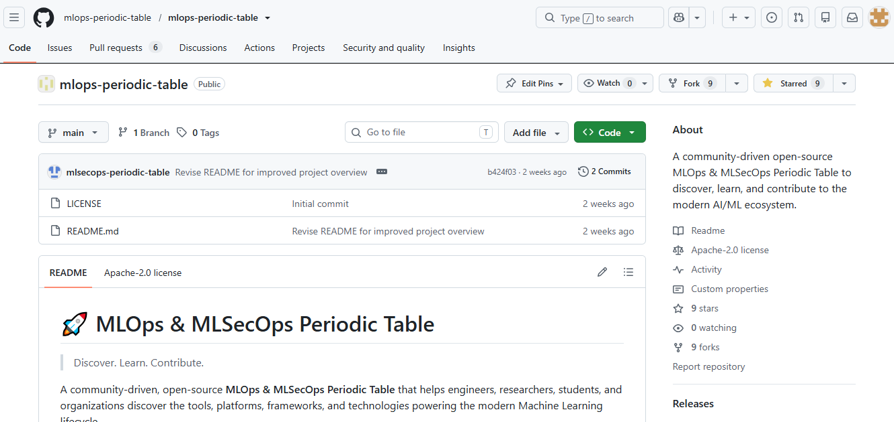
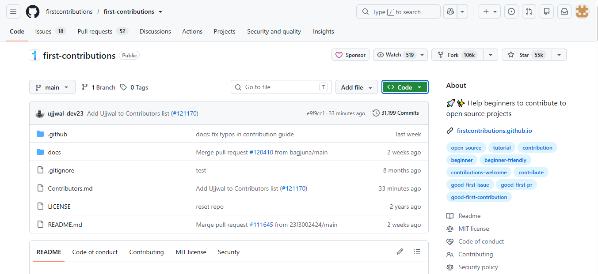
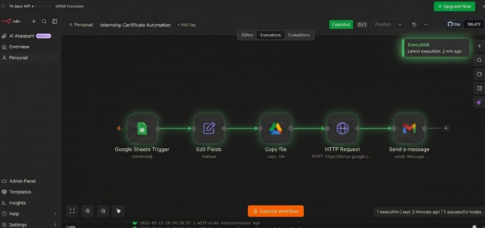

# 🖼️ Internship Gallery

This gallery showcases the major tasks completed during my internship at **iGradAI Labs Private Limited**.

---

## 📂 GitHub Repository

The GitHub repository used to manage internship tasks, projects, and documentation.

---

## 🌍 First Open Source Contribution

Successfully made my first contribution to an open-source project using GitHub.

---

## 🎓 Certificate Generation Workflow

Designed and implemented an automated certificate generation workflow using **n8n**.

